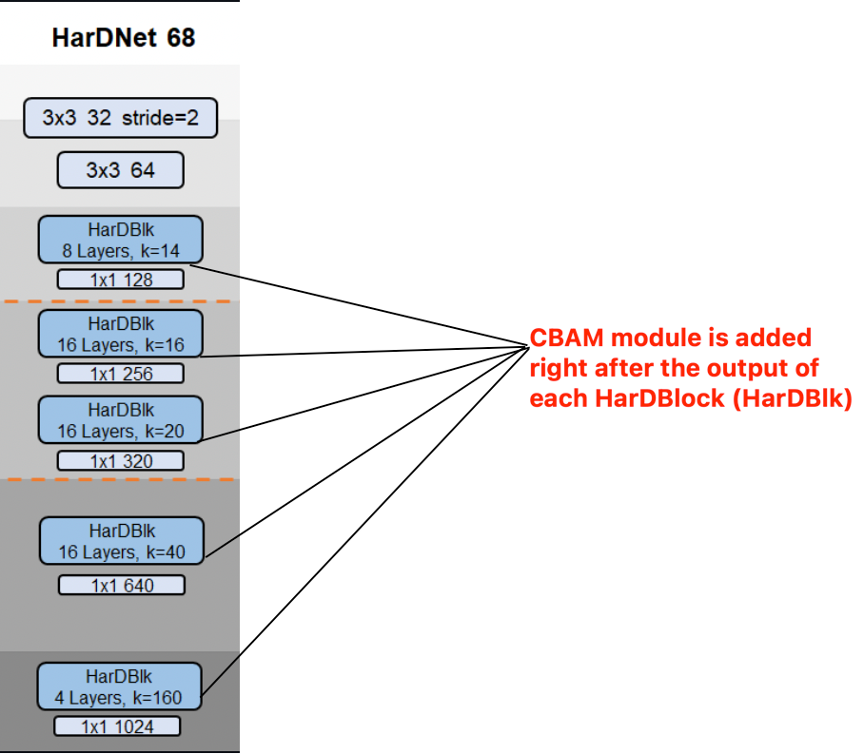

# Medical Image Segmentation summer project

## Summary
This is the source code of a medical segmentation project that I've worked on during my summer internship. The segmentation method in this repository is not really interesting so it will not be publishable (at least, I think so). I think that was also my fault for not really putting effort into this problem. Nevertheless, I've managed do get some results by running some experiments (which is described in this [report](./Medical-Img-Segmentation-notes.pdf)).

I'm gonna release this code so that anyone who are interested in using this project will be able to adopt it and improve it. I'm hoping for nothing more than to contribute to future innovations in the AI landscape, even though such contributions might not be much of a deal (or I might not be able to contribute anything with this project 🙂).

## For anyone who don't want to read the report
Yeah, I know. Reading the report is so much work (especially when my writing is horrible - working on improving it now). Long story short, I inserted the [CBAM](https://arxiv.org/abs/1807.06521) module into the middle of the two depthwise architectures of [HarDNet](https://arxiv.org/abs/1909.00948). The result is, again, not much interesting.

You can look at the following figure to see where is that CBAM module is inserted.


You can find the experimental results in the [report](./Medical-Img-Segmentation-notes.pdf). I'm really lazy to render the results here.

## 1. Create environment
  + Create conda environment with following command `conda create -n <anything_u_want_here> python=3.7`
  + Activate environment with following command `conda activate <anything_u_want_here>`
  + Install requirements with following command `pip install -r requirements.txt`
  
## 2. Prepare datasets
  + Download dataset from following [URL](https://drive.google.com/file/d/17Cs2JhKOKwt4usiAYJVJMnXfyZWySn3s/view?usp=sharing) (from the original UACANet authors)
  + Move folder `data` to the repository.
  + Folder should be ordered as follows,
```
|-- configs
|-- data
|   |-- TestDataset
|   |   |-- CVC-300
|   |   |   |-- images
|   |   |   `-- masks
|   |   |-- CVC-ClinicDB
|   |   |   |-- images
|   |   |   `-- masks
|   |   |-- CVC-ColonDB
|   |   |   |-- images
|   |   |   `-- masks
|   |   |-- ETIS-LaribPolypDB
|   |   |   |-- images
|   |   |   `-- masks
|   |   `-- Kvasir
|   |       |-- images
|   |       `-- masks
|   `-- TrainDataset
|       |-- images
|       `-- masks
|-- EvaluateResults
|-- lib
|   |-- backbones
|   |   `--hardnet
|   |-- losses
|   `-- segmenter
|       `-- modules
|-- results
|-- run
|-- snapshots
|   |-- UACANet-L
|   `-- UACANet-S
`-- utils
```

## 3. Train & Evaluate
  + You can train with `python run/Train.py --config configs/<model_name>.yaml`,
  + You can generate prediction for test dataset with `python run/Test.py --config configs/<model_name>.yaml`,
  + You can do speedtest 🚀 with `python run/speedtest.py --config configs/<model_name>.yaml`,
  + You can evaluate generated prediction with `python run/Eval.py --config configs/<model_name>.yaml`,
  + You can also use `python Expr.py --config configs/<model_name>.yaml` to train, generate prediction, do speedtest 🚀, and evaluation in single command.
  
  + (optional) Download best result checkpoint from following [URL](https://drive.google.com/file/d/1C5ag5X_gKR1IHW6fVAHdMggu7ilU1XbC/view?usp=sharing) for UACANet-L and UACANet-S (from original UACANet author).

## 6. Acknowledgement
 + Most of the source code is brought from [UACANet](https://github.com/plemeri/UACANet) with some modifications for my internship project. This project would have not been possible without the UACANet's authors great work!
