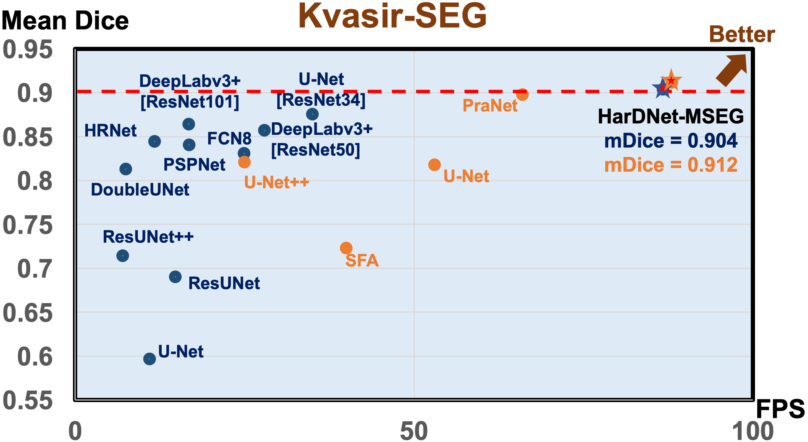
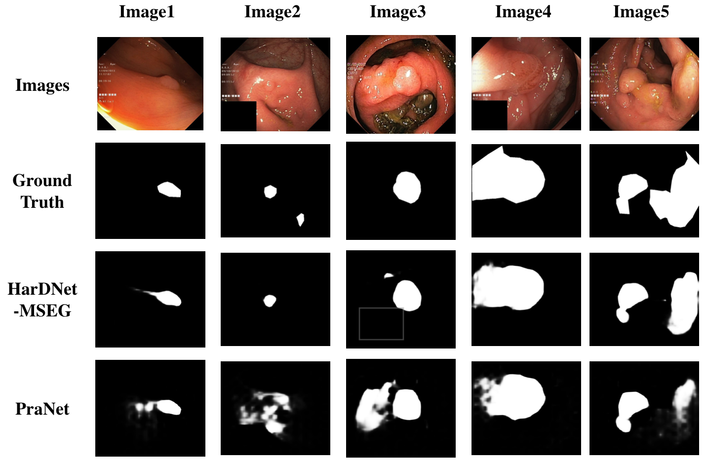
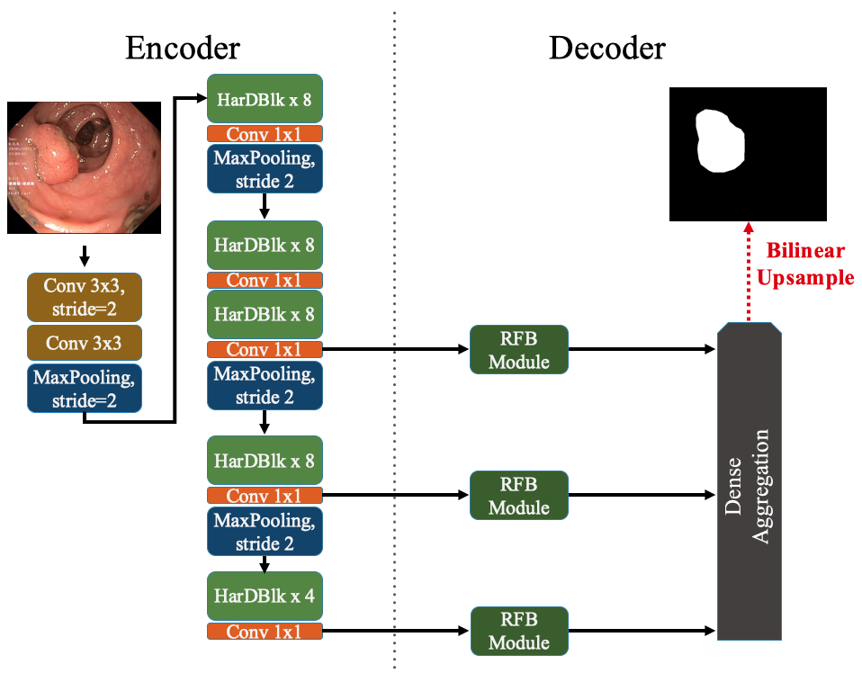
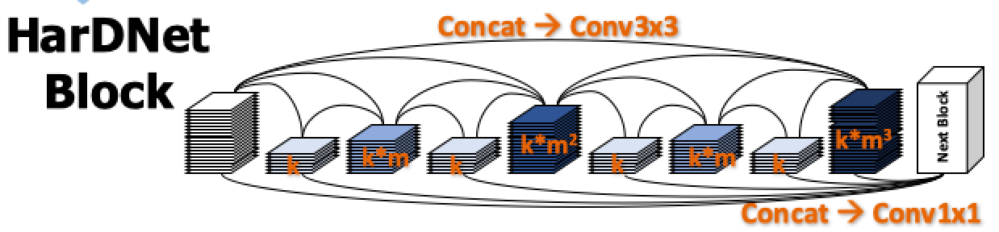

# HarDNet-MSEG: A Simple Encoder-Decoder Polyp Segmentation Neural Network that Achieves over 0.9 Mean Dice and 86 FPS

> Arxiv Paper : [**HarDNet-MSEG: A Simple Encoder-Decoder Polyp Segmentation Neural Network that Achieves over 0.9 Mean Dice and 86 FPS**](https://arxiv.org/abs/2101.07172)

> ICCV 2019 Paper : [**HarDNet: A Low Memory Traffic Network**](https://arxiv.org/abs/1909.00948)

## HarDNet Family
#### For Image Classification : [HarDNet](https://github.com/PingoLH/Pytorch-HarDNet) A Low Memory Traffic Network
#### For Object Detection : [CenterNet-HarDNet](https://github.com/PingoLH/CenterNet-HarDNet) 44.3 mAP / 45 fps on COCO Dataset
#### For Semantic Segmentation : [FC-HarDNet](https://github.com/PingoLH/FCHarDNet)  76.0 mIoU / 53 fps on Cityscapes Dataset


## Main results
<p align="center">  </p>

### Performance on Kvasir-SEG Dataset  
(Training/Testing split = 880/120 according to [**Real-Time Polyp Detection, Localisation and Segmentation in Colonoscopy Using Deep Learning**](https://arxiv.org/abs/2011.07631)) 
(FPS measures on 2080Ti)

| Models       | mIoU   | mDice  | F2-score      |Precision   | Recall   | Overall Acc.| FPS|
| :----------: | :----: | :----: | :-----------: | :--------: | :------------: | :---------------: |:--------------: | 
|U-Net         | 0.471  | 0.597  | 0.598         |0.672       | 0.617| 0.894| 11|
|ResUNet |0.572| 0.690 |0.699 |0.745| 0.725| 0.917| 15|
|DoubleUNet |0.733| 0.813 |0.820 |0.861 |0.840 |0.949 |7.5|
|DeepLabv3+[ResNet50] |0.776| 0.857 |0.855 |0.891| 0.8616 |0.961 |28|
|U-Net[ResNet34]| 0.810 |0.876| 0.862 |**0.944**| 0.860 |0.968| 35|
|**HarDNet-MSEG** |**0.848**   |  **0.904**| **0.915**| 0.907| **0.923**| **0.969**|**86.7**|

### Performance on Kvasir-SEG Dataset
(Training/Testing split = 1450 from 5 datasets /100 from Kvasir-SEG according to [**PraNet: Parallel Reverse Attention Network for Polyp Segmentation**](https://arxiv.org/abs/2006.11392)) (FPS measures on 2080Ti)

| Models       | mDice   | mIoU  | wfm      |Sm   | MAE   | maxEm | FPS|
| :----------: | :----: | :----: | :-----------: | :--------: | :------------: | :---------------: |:--------------: | 
|U-Net         | 0.818  | 0.746  | 0.794         |0.858       | 0.055| 0.893| 11|
|U-Net++ |0.821 |0.743 |0.808 |0.862 |0.048 |0.910| 25|
|SFA |0.723| 0.611| 0.67| 0.782 |0.075 |0.849| 40|
|PraNet |0.898 |0.840| 0.885| 0.915| 0.030| 0.948| 66|
|[**HarDNet-MSEG**](https://drive.google.com/file/d/1nj-zv64RiWwYjCmWg4NME7HNf_nBncUu/view?usp=sharing) |**0.912**| **0.857**| **0.903**| **0.923** |**0.025**|**0.958** |**88**|

###  Sample Inference Results of Kvasir-SEG Dataset comparing with PraNet

<p align="center">  </p>

## HarDNet-MSEG Architecture
<p align="center">  </p> 

- A Simple Encoder-Decoder architecture

- Encoder Part : Using HarDNet68 as backbone

<p align="center">  </p> 

```
    + k = growth rate (as in DenseNet)
    + m = channel weighting factor (1.6~1.7)
    + Conv3x3 for all layers (no bottleneck layer)
    + No global dense connection (input of a HarDBlk is NOT reused as a part of output)
```

- Decoder Part : Adopted from [Cascaded Partial Decoder](https://github.com/wuzhe71/CPD)

```
    + Using RFB Block for increasing the receptive field and strengthening the features.
    + Dense aggregation for fusing the features.
```

## Installation & Usage
### 1. Training/Testing


- Environment setting (Prerequisites):
    
    + `conda create -n *your_env_name* python=3.6`.
    
    + Then install PyTorch 1.1.

- Downloading necessary data:

    **For Kvasir-SEG Dataset reference from**
    [**Real-Time Polyp Detection, Localisation and Segmentation in Colonoscopy Using Deep Learning**](https://arxiv.org/abs/2011.07631)
    **(Only training using Kvasir-SEG, 880 images for training 120 images for testing)**
    
     + downloading testing dataset and move it into your test_path
    which can be found in this [download link (Google Drive)](https://drive.google.com/file/d/1us5iOMWVh_4LAiACM-LQa73t1pLLPJ7l/view?usp=sharing).
    
    + downloading training dataset and move it into your train_path
    which can be found in this [download link (Google Drive)](https://drive.google.com/file/d/17sUo2dLcwgPdO_fD4ySiS_4BVzc3wvwA/view?usp=sharing).
   
    
    **For each Dataset training including Kvasir-SEG, CVC-ColonDB, EndoScene, ETIS-Larib Polyp DB and CVC-Clinic DB from**
    [**PraNet: Parallel Reverse Attention Network for Polyp Segmentation**](https://arxiv.org/abs/2006.11392)
    
    + downloading testing dataset and move it into your test_path
    which can be found in this [download link (Google Drive)](https://drive.google.com/file/d/1o8OfBvYE6K-EpDyvzsmMPndnUMwb540R/view?usp=sharing).
    
    + downloading training dataset and move it into your train_path
    which can be found in this [download link (Google Drive)](https://drive.google.com/file/d/1lODorfB33jbd-im-qrtUgWnZXxB94F55/view?usp=sharing).
   
- Training :

    1. First download pretrain_weight : hardnet68.pth for HarDNet68 in https://github.com/PingoLH/Pytorch-HarDNet  
    
    2. Change the weight path in lib/hardnet_68.py line 203 for loading the pretrain_weight  
    
    3. Change the --train_path & --test_path in Train.py  
    
    4. Final step is to run the Train.py  

- Testing & inference result :

    1. Change the data_path in Test.py (line 16) 
    
    2. Here is the weight we trained for Kvasir-SEG using on the report https://drive.google.com/file/d/1nj-zv64RiWwYjCmWg4NME7HNf_nBncUu/view?usp=sharing   
    
       Download it, and run "python Test.py --pth_path "path of the weight"    
    
       And you can get the inference results in results/
    

### Evaluation :

1. Change the image_root, gt_root in line 49, 50 in eval_Kvasir.py  
2. Run the eval_Kvasir.py to get a similar result (about +0.002) to our report for Kvasir Dataset.  

Another one is written in MATLAB code ([link](https://drive.google.com/file/d/1_h4_CjD5GKEf7B1MRuzye97H0MXf2GE9/view?usp=sharing)).
You can see how to run it in https://github.com/DengPingFan/PraNet#32-evaluating-your-trained-model-
And our report is using this code to evaluate.

### 3. Acknowledgement

- A large part of the code is borrowed from     
**PraNet** (https://github.com/DengPingFan/PraNet) (https://arxiv.org/abs/2006.11392)        
**Cascaded Partial Decoder** (https://github.com/wuzhe71/CPD) (https://arxiv.org/abs/1904.08739)    
Thanks for their wonderful works.  

- This research is supported in part by a grant from the **Ministry of Science and Technology (MOST) of Taiwan**.   
We thank **National Center for High-performance Computing (NCHC)** for providing computational and storage resources.        
We would also like to thank **[Mr.Ping Chao](https://github.com/PingoLH)** for many fruitful discussions.


## Citation
If you find this project useful for your research, please use the following BibTeX entry.

      @misc{huang2021hardnetmseg,
      title={HarDNet-MSEG: A Simple Encoder-Decoder Polyp Segmentation Neural Network that Achieves over 0.9 Mean Dice and 86 FPS}, 
      author={Chien-Hsiang Huang and Hung-Yu Wu and Youn-Long Lin},
      year={2021},
      eprint={2101.07172},
      archivePrefix={arXiv},
      primaryClass={cs.CV}
      } 
      
      @inproceedings{chao2019hardnet,
      title={Hardnet: A low memory traffic network},
      author={Chao, Ping and Kao, Chao-Yang and Ruan, Yu-Shan and Huang, Chien-Hsiang and Lin, Youn-Long},
      booktitle={Proceedings of the IEEE International Conference on Computer Vision},
      pages={3552--3561},
      year={2019}
      }
      
